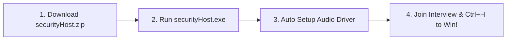

  <!-- Animated SVG Title Banner -->
  

  

    <b>The Ultimate Enterprise-Grade Invisible AI Co-Pilot For Technical & Coding Interviews</b>
  

  <!-- Badges -->
  

    
    
    
    
  

   

  <!-- Call-to-action Download Buttons -->
  

    
    &nbsp;&nbsp;
    
  

## 🌟 Key Features

<table>
  <tr>
    <td width="50%">
      <h3>🛡️ 100% Screen Share Immunity</h3>
      
Uses Windows DWM Affinity (<code>WDA_EXCLUDEFROMCAPTURE</code>). Invisible on <b>Zoom</b>, <b>Microsoft Teams</b>, <b>Google Meet</b>, <b>Discord</b>, and screen recorders.

    </td>
    <td width="50%">
      <h3>👁️‍🗨️ Taskbar & Alt+Tab Hiding</h3>
      
Operates in stealth mode (<code>WS_EX_TOOLWINDOW</code>). Excluded from the taskbar, Alt+Tab app switcher, and Windows Task View for total discretion.

    </td>
  </tr>
  <tr>
    <td width="50%">
      <h3>🔒 Process Camouflage & Anti-Tamper</h3>
      
Equipped with 4-tier anti-debugging (<code>NtQueryInformationProcess</code>, QPC timing loops), in-memory XOR token masking, and Task Manager hiding.

    </td>
    <td width="50%">
      <h3>🧠 Multi-Brain AI Engine Matrix</h3>
      
Connects Gemini 2.5, NVIDIA, Groq, OpenRouter, and local models. Features automatic API key rotation and zero-downtime failover switching.

    </td>
  </tr>
  <tr>
    <td width="50%">
      <h3>🎧 Smart Audio Listener</h3>
      
Transcribes the interviewer's spoken questions directly from your computer speakers or microphone with auto-configured VB-Cable driver setup.

    </td>
    <td width="50%">
      <h3>📸 1-Click Screen Snapshot (Ctrl+H)</h3>
      
Instantly captures live coding challenges, system architecture diagrams, or MCQs directly off your screen and delivers AI solutions in seconds.

    </td>
  </tr>
</table>

---

## ⌨️ Verified Keyboard Shortcuts & Controls

| Shortcut | Action | Stealth Mode |
| :---: | :--- | :---: |
| <kbd>Ctrl</kbd> + <kbd>H</kbd> | **Take Screen Snapshot & AI Solve** | 📸 Instant |
| <kbd>Ctrl</kbd> + <kbd>B</kbd> | **Toggle Response Overlay Panel** | 👁️ Hide/Show |
| <kbd>Ctrl</kbd> + <kbd>P</kbd> | **Toggle Voice Listener** | 🎧 Audio |
| <kbd>Ctrl</kbd> + <kbd>Alt</kbd> + <kbd>B</kbd> | **Panic Stealth (Hide All)** | 🥷 Off-Screen |
| <kbd>Ctrl</kbd> + <kbd>T</kbd> | **Toggle Click-Through Transparency** | 👻 Mouse Pass |
| <kbd>Ctrl</kbd> + <kbd>G</kbd> | **Toggle Web AI Browser Panel** | 🌐 Browser |
| <kbd>Ctrl</kbd> + <kbd>M</kbd> | **Toggle Speaker vs Microphone Target** | 🔊 Mode |
| <kbd>Ctrl</kbd> + <kbd>R</kbd> | **Reset Interview Session Chat** | 🔄 Clear |
| <kbd>Ctrl</kbd> + <kbd>X</kbd> | **Send Manual Input Prompt** | 💬 Send |
| <kbd>Ctrl</kbd> + <kbd>Alt</kbd> + <kbd>I</kbd> | **Global Launch Hotkey** | 🚀 Launch |
| <kbd>Ctrl</kbd> + <kbd>Alt</kbd> + <kbd>Q</kbd> | **Exit Application** | 🚪 Exit |
| <kbd>↑</kbd> <kbd>↓</kbd> <kbd>←</kbd> <kbd>→</kbd> | **Smooth Scroll Navigation** | 📜 Scroll |

---

## 🚀 Easy 4-Step Setup Guide

### 📥 Step 1: Download
Click a direct download badge below to get the latest release:

 &nbsp; 

### 🛡️ Step 2: Allow Windows Security
If Windows SmartScreen appears:
1. Click **More Info** ➔ **Run Anyway**.
2. Run `securityHost.exe` with Administrator access.

### 🔊 Step 3: Automatic Driver Configuration
On launch, the software automatically configures the background audio listener driver for speaker transcription.

### 🎯 Step 4: Win Your Technical Interview
Join your Zoom or Teams call, press <kbd>Ctrl</kbd> + <kbd>H</kbd> for screen snapshots, or let the speaker listener transcribe questions in real time!

---

## 💳 Access Pass Plans & Pricing

| Pass Type | Price | Duration | Best For | Features Included |
| :---: | :---: | :---: | :--- | :--- |
| **1 Day Pass** | **₹400** | 24 Hours | Urgent interview calls today | 100% Stealth, All AI Engines, Voice Listener, Snapshot Tool |
| **2 Days Pass** | **₹500** | 48 Hours | Multi-round interview days | 100% Stealth, All AI Engines, Voice Listener, Snapshot Tool |
| **1 Month Pass** | **₹5000** | 30 Days | Full job search campaign | Unlimited Usage, Priority Key Rotation, Continuous Backups |

### 💰 Instant Payment (UPI)
- **UPI ID**: `8317277608@pthdfc`
- **Supported Apps**: Google Pay, PhonePe, Paytm, BHIM, HDFC PayZapp.

---

## ❓ Frequently Asked Questions (FAQ)

<b>1. Is InterviewAI really invisible on Zoom and Microsoft Teams?</b>

 
Yes, 100%. InterviewAI uses native Windows Display Manager capture protection (<code>WDA_EXCLUDEFROMCAPTURE</code>) which prevents screen sharing applications like Zoom, Microsoft Teams, Google Meet, and OBS from capturing the window.

<b>2. How does real-time speaker audio listening work?</b>

 
InterviewAI captures audio directly from your computer speakers via VB-Cable loopback, transcribes the interviewer's question in real time, and displays instant solution key points.

<b>3. What happens if an AI provider key rate limits?</b>

 
InterviewAI features an automated multi-brain matrix. If one provider fails or hits a rate limit, it instantly fails over to backup AI providers (Gemini ➔ NVIDIA ➔ Groq ➔ OpenRouter) with zero interruption.

<b>4. How do I reset history between interview rounds?</b>

 
Press <kbd>Ctrl</kbd> + <kbd>R</kbd> to clear your interview chat session and reset the response panel for your next round.

---

  Built with ❤️ for Technical Candidates. Copyright © 2026 Interview Suite Security. All Rights Reserved.

